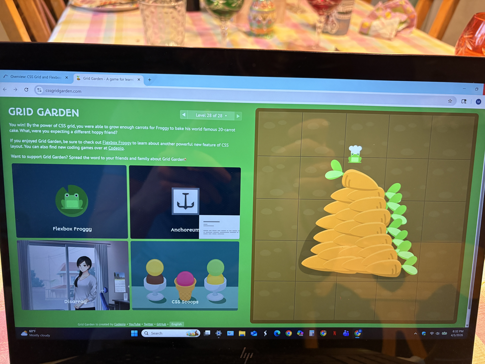

This week went well. It was very busy with outside of school stuff, Easter celebrations, and another large project, but this wasn't too bad. I kept it simple this week and added a cleaner navigation and footer to my assignment 4 while also changing the look to something that was cleaner rather than just the default. Now I feel like I have a much better grasp on flexbox than I did and I see the purpose more. Grid already made sense to me, and component based thinking is an idea I understand.